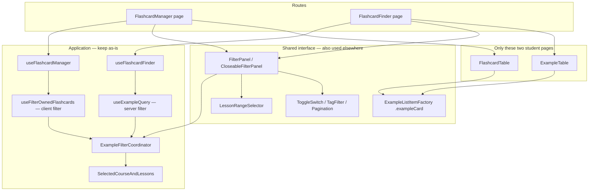

# Student Flashcard Surfaces

Architecture note for the first student redesign phase: **Flashcard Manager** and **Flashcard Finder**. Visual design comes later. This file is the nearby-docs source of truth for how to start that work without contaminating other surfaces.

Related: [`interface/styles/README.md`](../styles/README.md) (cascade layers, tokens, `UiScope`), [`interface/DECISIONS.md`](../DECISIONS.md), [`interface/BOUNDARIES.md`](../BOUNDARIES.md).

---

## What exists today

Two student routes, already hexagon pages, each calling one use case:

| Route                | Page                                             | Use case              |
| -------------------- | ------------------------------------------------ | --------------------- |
| `/manage-flashcards` | [`FlashcardManager.tsx`](./FlashcardManager.tsx) | `useFlashcardManager` |
| `/flashcardfinder`   | [`FlashcardFinder.tsx`](./FlashcardFinder.tsx)   | `useFlashcardFinder`  |

Both pages are a heading + **filter section** + **results table**. They are not isolated from the rest of the app.



**Treat Manager and Finder as one redesign surface.** Students move between them (`Find More Matching Flashcards`, `Use these filters on my flashcards` via `?enableFiltering=true`). They share filter chrome and list-item chrome.

**Superseded, 2026-08: the two routes ship behind separate flags.** The design handoff covers the Finder only, so `ui.student.flashcards.finder.v2` gates `/flashcardfinder` and the Manager gets its own flag when its design lands. A shared flag would have put a half-redesigned Manager in front of anyone who turned the Finder on. Everything else on this page still holds — the two pages remain one redesign _surface_, they share the same primitives and the same filter coordinator, and the Manager's rewrite should reuse whatever the Finder builds.

Do not wrap Custom Quiz or Review My Flashcards under either flag.

The shared primitives those pages will compose are built ahead of the page work; see [`components/general/README.md`](../components/general/README.md) for the primitive contract and `/ui-gallery` (`VITE_UI_FLAGS=ui.dev.gallery`) to view them.

### Two constraints on the results table

**No lesson column on either table.** Neither the Finder nor the Manager shows a lesson per row. The value either is not stored against the record or is too expensive to derive for every row on the page. Both tables omit the column rather than showing a blank or paying for the lookup. A row is therefore: select, Spanish, English, expand.

**Below 768px the row reflows** rather than scrolling sideways: Spanish stacks over English while the checkbox and chevron stay in place, spanning both lines. `DataTable` takes this as a `mobileLayout` prop; the areas are named by the caller.

---

## Data: keep the two pipelines

The UI looks similar; the data paths are different. Redesign must not merge them.

|                    | Flashcard Finder                                    | Flashcard Manager                                                             |
| ------------------ | --------------------------------------------------- | ----------------------------------------------------------------------------- |
| Source             | Catalog examples via `useExampleQuery`              | Owned flashcards via `useStudentFlashcards`                                   |
| Filter application | Server query (coordinator → API)                    | Client `filterExamplesCombined` in `useFilterOwnedFlashcards`                 |
| Pagination         | `useQueryPagination` — fetch 150, show 25, prefetch | `usePagination` — slice owned list, page size 25                              |
| Filter UI          | Always on (`FilterPanel`)                           | Optional (`CloseableFilterPanel` toggle)                                      |
| Row actions        | Add/remove from collection                          | Bulk select + remove; copy; delete all owned Spanglish; quiz / find-more menu |

Filter **state** is global: [`useExampleFilterCoordinator`](../../application/coordinators/hooks/useExampleFilterCoordinator.ts) plus course/lesson selection. That is why Finder → Manager and Manager → Review My Flashcards can reuse filters without copying URL state. **Do not replace the coordinator for the redesign.** New filter UI must read/write the same coordinator, preferably through the page use case rather than by calling it from the panel.

`useFlashcardFinder` already returns `exampleFilter` and `skillTagSearch`; the page ignores them. `useCombinedFilters` is subscribed **three times** on Finder (page use case, `useExampleQuery`, and `FilterPanel`). That is the seam to close when the new filter section is presentational.

Finder fetch is gated: `useExampleQuery` only runs when a filter seed exists (lesson range, tags, exclude-Spanglish, or audio-only). An empty-looking Finder with no course/lesson selected is current behavior, not a loading bug. Preserve that unless product says otherwise.

---

## Isolation: what we must not restyle in place

CSS foundation (already shipped). See [`styles/README.md`](../styles/README.md).

- Layers: `legacy` < `tokens` < `primitives` < `features`
- New student UI: CSS Modules + tokens (`var(--color-*)`, `var(--space-*)`, …)
- Opt-in: `StudentUiFlag` + [`UiScope`](../components/general/UiScope/UiScope.tsx) (`display: contents`, `data-ui="v1"` or `data-ui="v2"`)
- Do not edit `App.css` or shared global classes for a single surface ([`DECISIONS.md`](../DECISIONS.md))

**Unsafe to restyle in place** (other live surfaces depend on the same global classes):

- [`Filters/FilterPanel.scss`](../components/Filters/FilterPanel.tsx) — also Custom Quiz and Review My Flashcards
- [`ExampleListItem.scss`](../components/ExampleListItem/ExampleListItemFactory.tsx) / `.exampleCard` — also admin Example Search (`BaseResultsComponent`, `MaxFrequencyResultsComponent`)
- [`LessonSelector.css`](../components/LessonSelector/LessonRangeSelector.tsx), [`ToggleSwitch.scss`](../components/general/ToggleSwitch/ToggleSwitch.tsx), [`Pagination.scss`](../components/general/Pagination/Pagination.tsx), [`VocabTagFilter`](../components/general/VocabTagFilter)
- [`App.css`](../../../App.css) blocks labeled Flashcard Manager / Finder / shared `.exampleCardSpanishText`

**Safer to replace on these pages only** (consumers are just Manager and Finder):

- [`FlashcardTable.tsx`](../components/Tables/FlashcardTable.tsx)
- [`ExampleTable.tsx`](../components/Tables/ExampleTable.tsx)

Those tables still import global SCSS that also styles `.exampleCard`, so converting the SCSS files themselves would leak. Replace the _components_ with new modules; leave the old SCSS for whoever still imports it.

Dead leftover: [`Filters/FlashcardFinder.scss`](../components/Filters/FlashcardFinder.scss) is a copy-from-App.css remnant and is not imported by the Finder page.

---

## How we will start (when design work begins)

Follow the CSS README recipe, scoped to this surface:

1. Add `ui.student.flashcards.v2` to [`uiFlags.ts`](../../domain/uiFlags.ts). Enable locally with `VITE_UI_FLAGS`. Leave unset in production until the surface is ready.
2. Wrap **both** route elements in [`AppRoutes.tsx`](../../../routes/AppRoutes.tsx) with `<UiScope flag="ui.student.flashcards.v2">`. Do not wrap Custom Quiz, Review My Flashcards, or Get Help.
3. Do **not** restyle existing FilterPanel / ExampleListItem / App.css. Build new feature CSS Modules that only mount under these pages.
4. Keep [`useFlashcardFinder`](../../application/useCases/useFlashcardFinder/useFlashcardFinder.ts) and [`useFlashcardManager`](../../application/useCases/useFlashcardManager/useFlashcardManager.ts). This is an interface redesign, not new application behavior.
5. New v2 filter section is **presentational**: props from the page use case (Finder already has the data; Manager should expose the same filter fields when the toggle is on). Old `FilterPanel` stays for quiz/review.
6. New v2 table + row live as feature components shared by the two pages, not as edits to admin `ExampleListItem`. Existing comment on [`FlashcardFinderExampleListItem.tsx`](../components/ExampleListItem/FlashcardFinderExampleListItem.tsx) already wants finder rows colocated with Finder.

Suggested layout when implementation starts (not this writeup):

```
interface/components/studentFlashcards/   # shared by the two pages only
  FilterSection/     # CSS module, features layer, props-only
  ResultsTable/      # header, count, options, pagination slot
  ExampleRow/        # add/remove vs bulk-remove via props
interface/pages/FlashcardFinder/
  FlashcardFinder.tsx
  FlashcardFinder.module.scss
interface/pages/FlashcardManager/
  FlashcardManager.tsx
  FlashcardManager.module.scss
```

Promote to [`interface/components/general/`](../components/general/) (`@layer primitives`) only when a control is truly generic. Today the only redesign primitives are [`Button`](../components/general/Buttons/Button/Button.tsx) and [`UiScope`](../components/general/UiScope/UiScope.tsx). Pagination, ToggleSwitch, TagFilter, LessonRangeSelector, and FilterPanel are still global SCSS in `@layer legacy`. Do not convert those in a big bang; that would restyle quiz and admin. Version them as primitives when this surface needs a v2 look, used only from the new feature components.

Breakpoints stay **480px** and **768px** (not CSS variables).

---

## Boundary debt to fix only when touching that UI

Do not boil the ocean in a writeup or flag-wrap PR. Record these so the first implementation PR can clean the seam it rewrites:

- `FilterPanel` and `LessonRangeSelector` call application hooks directly (one-hook-per-component / presentational-components rule). New v2 filter should receive props from the page use case.
- `FlashcardTable` calls a second use case (`useFlashcardTable` — selection + delete). Fold that into `useFlashcardManager` or keep it as the table’s single hook, but the page should not grow a third orchestration path.
- `ExampleTable` calls `useAuthAdapter` for an admin clipboard item. Push that flag through the Finder use case if the v2 table still needs it.
- Both pages parse `enableFiltering` with `useLocation` / `useNavigate` beside the use case. Move URL bootstrap into the use case (or a tiny visual-only wrapper) when the page is rewritten.
- Finder use case has no tests; neither page has tests. Add them when the v2 page/components land ([`TESTING_STANDARDS.md`](../../../../documentation/TESTING_STANDARDS.md), 100% interface).
- `onGoingToQuiz` on Manager sets local filter state then navigates away; Review My Flashcards actually keys off the URL param. Revisit that when wiring the ellipsis menu.
- Manager table options include `DeleteAllOwnedSpanglish` (extra application hooks in a leaf). Keep the action in the v2 menu; move the mutation through the page/table hook.
- `/manage-flashcards` is ungated in [`AppRoutes.tsx`](../../../routes/AppRoutes.tsx); Finder requires student/coach/admin. Out of scope for restyling, but do not silently copy the ungated route if we touch routing.
- `includeUnpublished` is collected in filter state and passed through the query hook, but infrastructure `getFilteredExamples` does not put it on the POST body. Product/API bug, not a CSS task — do not “fix” it as a side effect of restyling.

Out of scope for this surface: Custom Quiz, Review My Flashcards (shares `CloseableFilterPanel` **and** `useFilterOwnedFlashcards`), admin Example Manager, Get Help (`ui.student.help.v2` exists but that page is not wrapped and is not this phase).

---

## Implementation sequence later (design PR series)

When the visual design exists, ship small PRs in this order:

1. Flag + `UiScope` wrap on both routes (no visual change while the flag is off).
2. Page shell modules (heading, layout) using tokens; children still v1.
3. v2 `FilterSection` presentational, wired through existing use cases / coordinator.
4. v2 `ResultsTable` + `ExampleRow` (Finder add/remove, Manager bulk remove + menus).
5. Replace Pagination/Toggle/Tag chips with primitives only as those land in the new tree.
6. Remove the old table/filter imports from these two pages only. Leave global SCSS for quiz/admin.

Each PR stays flag-gated. Production stays v1 until the surface is complete.
